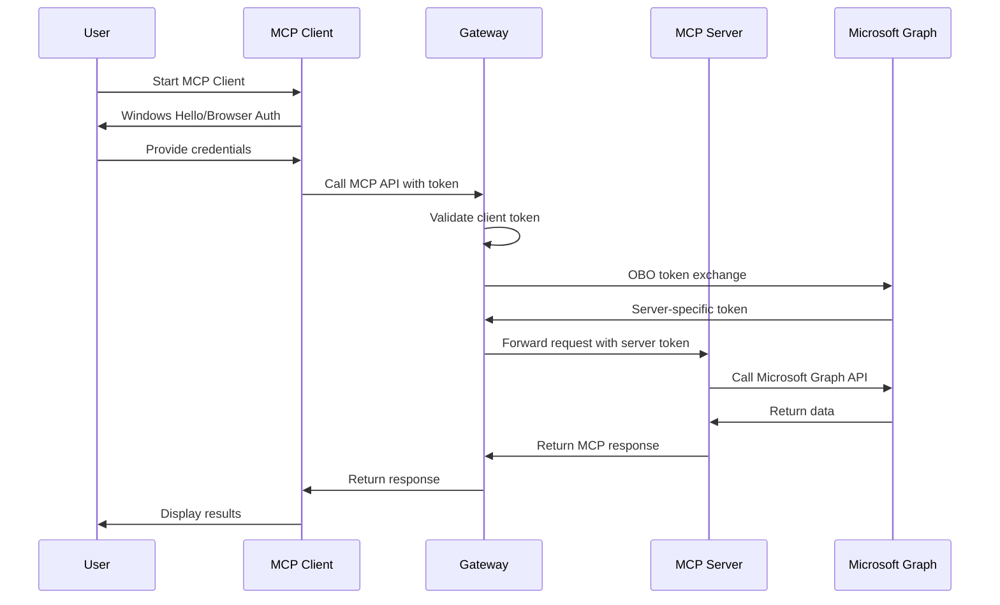

# Arkana MCP Gateway - Microsoft Entra ID Setup Hub

This is the central Microsoft Entra ID configuration hub for the Arkana MCP Gateway ecosystem. The gateway acts as the OAuth 2.0 server that brokers authentication between multiple MCP clients and servers.

## 🏗️ Architecture Overview

The Arkana ecosystem uses a **hub-and-spoke authentication** pattern:

```
[MCP Clients] → [Arkana Gateway] → [MCP Servers] → [Microsoft Graph/APIs]
  (Public)       (Confidential)      (Protected)       (Resources)
```

**Gateway Role**: Central authentication hub that performs On-Behalf-Of (OBO) token exchange

## 📋 Prerequisites

- Microsoft Entra ID tenant with admin permissions
- Microsoft 365 subscription (for Graph API access)
- Access to [Azure Portal](https://portal.azure.com)

## 🚀 Quick Start

**Choose your setup path:**

1. **🛠️ [Gateway Setup (Required First)](docs/AZURE_AD_GATEWAY.md)** - Core authentication server
2. **📱 [Graph MCP Client Setup](docs/AZURE_AD_GRAPH_CLIENT.md)** - Microsoft Graph client application
3. **🔧 [Custom MCP Client Setup](docs/AZURE_AD_CLIENT_TEMPLATE.md)** - Template for custom clients
4. **⚙️ [Custom MCP Server Setup](docs/AZURE_AD_SERVER_TEMPLATE.md)** - Template for custom servers

---

## 📚 Component Documentation

### Core Components

| Component | Description | Microsoft Entra ID Requirements |
|-----------|-------------|----------------------|
| **[Arkana Gateway](docs/AZURE_AD_GATEWAY.md)** | Central OAuth 2.0 server | Confidential client with OBO permissions |

### MCP Clients

| Client | Description | Setup Guide |
|--------|-------------|-------------|
| **[Graph User Client](_src/Graph.User.Mcp.Client/docs/AZURE_AD_SETUP.md)** | Microsoft Graph MCP client | Native/Public client |
| **[Custom Client](docs/AZURE_AD_CLIENT_TEMPLATE.md)** | Template for new clients | Native/Public client template |

### MCP Servers  

| Server | Description | Setup Guide |
|--------|-------------|-------------|
| **[Graph User Server](_src/Graph.User.Mcp.Server/docs/AZURE_AD_SETUP.md)** | Microsoft Graph MCP server | Protected API registration |
| **[Custom Server](docs/AZURE_AD_SERVER_TEMPLATE.md)** | Template for new servers | Protected API template |

---

## 🔄 Authentication Flow



---

## 🛠️ Setup Order

**Follow this order for successful setup:**

1. **🏭 [Gateway Setup](docs/AZURE_AD_GATEWAY.md)** *(Required first - provides auth foundation)*
2. **📊 [Graph MCP Server](_src/Graph.User.Mcp.Server/docs/AZURE_AD_SETUP.md)** *(Optional - if using Graph APIs)*  
3. **💻 [Graph MCP Client](_src/Graph.User.Mcp.Client/docs/AZURE_AD_SETUP.md)** *(Client for Graph APIs)*
4. **🔧 Custom Components** *(Use templates for additional clients/servers)*

---

## 1️⃣ Gateway Application Registration

### Step 1: Create the Gateway App Registration

1. **Navigate to Azure Portal:**
   - Go to [Azure Portal](https://portal.azure.com)
   - Search for "App registrations" and select it

2. **Create New Registration:**
   - Click **"New registration"**
   - **Name**: `Arkana MCP Gateway`
   - **Supported account types**: `Accounts in this organizational directory only`
   - **Redirect URI**: Leave empty for now
   - Click **"Register"**

3. **Save Important Values:**
   ```
   Application (client) ID: [Copy this - you'll need it]
   Directory (tenant) ID: [Copy this - you'll need it]
   ```

### Step 2: Configure API Permissions

1. **Go to "API permissions":**
   - Click **"Add a permission"**
   - Select **"Microsoft Graph"**
   - Choose **"Delegated permissions"**

2. **Add Required Permissions:**
   ```
   User.Read                    # Basic user profile
   User.ReadBasic.All          # Read basic user info for all users
   User.Read.All               # Read full user profiles
   Mail.ReadWrite              # Read and write mail
   Mail.Send                   # Send mail as user  
   Calendars.ReadWrite         # Read and write calendars
   Files.ReadWrite.All         # Read and write files (OneDrive + SharePoint)
   Sites.Read.All              # Read SharePoint sites
   Directory.Read.All          # Read directory data
   Group.Read.All              # Read groups
   GroupMember.Read.All        # Read group memberships
   Notes.Read.All              # Read OneNote notebooks
   Presence.Read.All           # Read user presence (Teams status)
   Tasks.ReadWrite             # Read and write tasks (To-Do)
   Contacts.ReadWrite          # Read and write contacts
   ```

3. **Grant Admin Consent:**
   - Click **"Grant admin consent for [your organization]"**
   - Confirm by clicking **"Yes"**

### Step 3: Configure Authentication

1. **Go to "Authentication":**
   - Click **"Add a platform"**
   - Select **"Web"**
   - **Redirect URIs**: Add your gateway URLs:
     ```
     https://localhost:8081/signin-oidc
     https://your-production-gateway.com/signin-oidc
     ```
   - **Front-channel logout URL**: 
     ```
     https://localhost:8081/signout-oidc
     https://your-production-gateway.com/signout-oidc
     ```

2. **Advanced Settings:**
   - ✅ **Access tokens** (used for implicit flow)
   - ✅ **ID tokens** (used for OpenID Connect)

### Step 4: Create Client Secret

1. **Go to "Certificates & secrets":**
   - Click **"New client secret"**
   - **Description**: `Arkana Gateway Production Secret`
   - **Expires**: Choose appropriate duration (24 months recommended)
   - Click **"Add"**

2. **Save the Secret Value:**
   ```
   Client Secret: [Copy immediately - won't be shown again]
   ```

### Step 5: Expose an API

1. **Go to "Expose an API":**
   - Click **"Set"** next to "Application ID URI"
   - Accept default or customize: `api://your-gateway-app-id`
   - Click **"Save"**

2. **Add a Scope:**
   - Click **"Add a scope"**
   - **Scope name**: `obo`
   - **Admin consent display name**: `Access Microsoft Graph on behalf of user`
   - **Admin consent description**: `Allows the gateway to access Microsoft Graph APIs on behalf of the signed-in user`
   - **User consent display name**: `Access your Microsoft 365 data`
   - **User consent description**: `Allow the gateway to access your Microsoft 365 data on your behalf`
   - **State**: `Enabled`
   - Click **"Add scope"**

---

## 2️⃣ Client Application Registration

### Step 1: Create the Client App Registration

1. **Create New Registration:**
   - Click **"New registration"**
   - **Name**: `Arkana MCP Client`
   - **Supported account types**: `Accounts in this organizational directory only`
   - **Redirect URI**: Select `Public client/native (mobile & desktop)` and add:
     ```
     https://login.microsoftonline.com/common/oauth2/nativeclient
     ```
   - Click **"Register"**

2. **Save Important Values:**
   ```
   Application (client) ID: [Copy this - for client configuration]
   Directory (tenant) ID: [Same as gateway app]
   ```

### Step 2: Configure Authentication

1. **Go to "Authentication":**
   - **Redirect URIs**: Ensure you have:
     ```
     https://login.microsoftonline.com/common/oauth2/nativeclient
     http://localhost
     ```
   - **Advanced settings:**
     - ✅ **Allow public client flows** (Enable the following mobile and desktop flows)

2. **Supported account types:**
   - Select: `Accounts in this organizational directory only`

### Step 3: Configure API Permissions

1. **Add Gateway API Permission:**
   - Go to **"API permissions"**
   - Click **"Add a permission"**
   - Select **"My APIs"** tab
   - Select your **Gateway App** (`Arkana MCP Gateway`)
   - Choose **"Delegated permissions"**
   - Select the **`obo`** scope you created
   - Click **"Add permissions"**

2. **Add Microsoft Graph Permissions:**
   - Click **"Add a permission"**
   - Select **"Microsoft Graph"**
   - Choose **"Delegated permissions"**
   - Add: `User.Read` (for basic sign-in)
   - Click **"Add permissions"**

3. **Grant Admin Consent:**
   - Click **"Grant admin consent for [your organization]"**

---

## 3️⃣ Configuration Values

### Gateway Configuration

Update your Gateway's `appsettings.local.json`:

```json
{
  "AzureAd": {
    "Instance": "https://login.microsoftonline.com/",
    "TenantId": "your-tenant-id",
    "ClientId": "your-gateway-app-client-id",
    "ClientSecret": "your-gateway-app-secret"
  }
}
```

### Client Configuration

Update your Client's `appsettings.local.json`:

```json
{
  "AzureAd": {
    "TenantId": "your-tenant-id",
    "ClientId": "your-client-app-client-id"
  },
  "Gateway": {
    "ApiScope": "api://your-gateway-app-client-id/obo"
  }
}
```

---

## 4️⃣ Testing Your Setup

### Test Client Authentication

1. **Run the MCP Client:**
   ```bash
   cd _src/Graph.User.Mcp.Client
   dotnet run
   ```

2. **Expected Flow:**
   - Windows Hello prompt appears
   - Browser opens for Microsoft Entra ID sign-in
   - User consents to permissions
   - Client displays "✅ Authentication successful"

### Test Gateway Token Exchange

1. **Run the Gateway:**
   ```bash
   cd _src/Gateway  
   dotnet run
   ```

2. **Test OBO Flow:**
   - Client should successfully call gateway endpoints
   - Gateway should exchange tokens for Microsoft Graph access
   - Commands like `users profile` should work

---

## 🔒 Security Considerations

### Production Deployment

- **Use certificates instead of client secrets** for the gateway app
- **Implement Conditional Access policies** to enforce MFA
- **Enable audit logging** for both applications
- **Regularly rotate secrets** (if using client secrets)
- **Review permissions quarterly** and apply principle of least privilege

### Certificate-based Authentication (Recommended)

1. **Generate a certificate:**
   ```powershell
   $cert = New-SelfSignedCertificate -Subject "CN=ArkanaGateway" -CertStoreLocation "Cert:\CurrentUser\My" -KeyExportPolicy Exportable -KeySpec Signature
   ```

2. **Upload to Microsoft Entra ID:**
   - Go to your Gateway app registration
   - Navigate to "Certificates & secrets"
   - Upload the certificate

3. **Configure Gateway:**
   ```json
   {
     "AzureAd": {
       "CertificateThumbprint": "your-cert-thumbprint",
       "UseCertificate": true
     }
   }
   ```

---

## 🛠️ Troubleshooting

### Common Issues

| Issue | Solution |
|-------|----------|
| **AADSTS65001: User consent required** | Ensure admin consent is granted for all permissions |
| **AADSTS50011: Redirect URI mismatch** | Verify redirect URIs match exactly in app registration |
| **AADSTS70011: Invalid scope** | Check the API scope format: `api://gateway-app-id/obo` |
| **OBO token exchange fails** | Verify gateway app has proper Microsoft Graph permissions |

### Debug Mode

Enable detailed logging in `appsettings.local.json`:

```json
{
  "Logging": {
    "LogLevel": {
      "Microsoft.AspNetCore.Authentication": "Debug",
      "Microsoft.Graph": "Debug"
    }
  }
}
```

---

## 📚 References

- [Microsoft Graph Permissions Reference](https://docs.microsoft.com/en-us/graph/permissions-reference)
- [OAuth 2.0 On-Behalf-Of Flow](https://docs.microsoft.com/en-us/azure/active-directory/develop/v2-oauth2-on-behalf-of-flow)
- [Microsoft Entra ID App Registration Best Practices](https://docs.microsoft.com/en-us/azure/active-directory/develop/security-best-practices-for-app-registration)