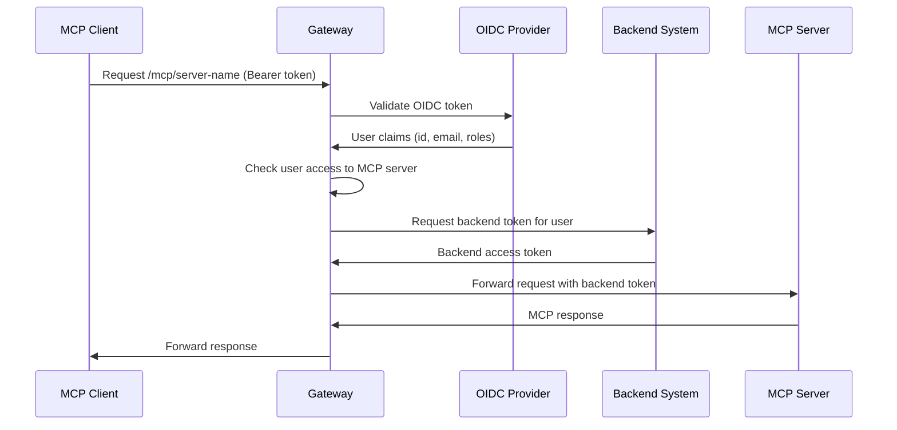

# MCP Enterprise Security Gateway - Implementation Documentation

> **📍 Navigation:** [Documentation Index](index.md) | [Development Standards](DEVELOPMENT_STANDARDS.md) | [Architecture Decisions](ARCHITECTURE_DECISIONS.md) | [Product Requirements](PRD.md)

## 🎯 Project Overview

The **Arkana MCP Gateway** transforms the existing reverse proxy into an enterprise-grade security gateway for Model Context Protocol (MCP) servers. This addresses critical security gaps in MCP adoption by providing centralized authentication, authorization, and audit capabilities.

**Target Deployment**: Azure-first architecture with local development support, optimized for enterprise environments using Azure Active Directory and Azure Key Vault.

### Key Objectives
- **Enterprise Security**: OIDC-based authentication with role-based access control
- **Token Brokerage**: Gateway provisions tokens for backend systems on behalf of users
- **Simplified Configuration**: User-friendly UI abstracts complex YARP settings
- **Comprehensive Audit**: Complete tracking of MCP interactions for compliance
- **Performance Optimization**: Security-first design with minimal latency impact

---

## ✅ Phase 1: Foundation & Data Layer (COMPLETED)

### Database Schema

#### Core Entities Created
```csharp
// Primary MCP server configuration
McpServer
├── McpBackendAuth (OAuth2/API key configuration)
│   └── McpUserApiKey[] (per-user API keys)
├── McpUserAssignment[] (direct user access)
├── McpRoleAssignment[] (role-based access)
└── McpAuditLog[] (comprehensive logging)
```

#### Security Features
- **Encrypted Credentials**: All API keys and OAuth2 secrets encrypted at rest
- **Soft Delete**: Data integrity with audit trail preservation
- **Performance Indexes**: Optimized for high-volume audit queries
- **Relationship Integrity**: Cascade deletes with audit log preservation

### Configuration Models

#### Simplified UI Configuration (`McpSimpleConfiguration`)
```csharp
public class McpSimpleConfiguration
{
    // Basic Info
    string Name, Description, Endpoint
    McpProtocolType Protocol (WebSocket/SSE/HTTP)
    
    // Security (simplified for UI)
    SecurityConfig Security
    ├── McpAuthType (None/OAuth2/ApiKey/Bearer)
    ├── OAuth2Settings (client credentials, scopes)
    ├── ApiKeySettings (global/per-user keys)
    └── Security Policies (HTTPS, token cache)
    
    // Access Control
    AccessConfig Access
    ├── AccessMode (RoleBased/UserBased/Mixed/Open)
    ├── AllowedUsers[]
    ├── AllowedRoles[]
    └── Expiration settings
    
    // Performance
    PerformanceConfig Performance
    ├── Connection limits and timeouts
    ├── Health check configuration
    └── Rate limiting settings
}
```

### Security-First YARP Translation

#### `McpConfigurationTranslator` Features
- **Automatic Security Transforms**: HTTPS enforcement, header sanitization
- **Protocol Optimization**: WebSocket/SSE vs HTTP-specific configurations
- **Authentication Integration**: Prepares for middleware token injection
- **Performance Tuning**: Connection pooling, rate limiting, health checks

#### Generated YARP Configuration
```yaml
Route Pattern: /mcp/{server-name}/**
Security Headers: Authorization required, HTTPS enforcement
Performance: Protocol-specific optimizations
Metadata: Security and performance settings for middleware
```

---

## 🔄 Phase 2: Authentication & Authorization (NEXT)

### 2.1 OIDC Integration Enhancement
**Objective**: Extract user roles/groups from OIDC tokens for authorization

#### Components to Build
```csharp
// Services
IOidcTokenService
├── ExtractUserClaims(token) → (userId, email, roles[])
├── ValidateToken(token) → ClaimsPrincipal
└── GetUserRoles(userId) → string[]

IUserAuthorizationService  
├── CanAccessMcpServer(userId, roles[], serverId) → bool
├── GetUserMcpServers(userId, roles[]) → McpServer[]
└── LogAccessAttempt(userId, serverId, success)
```

#### Implementation Tasks
1. **OIDC Token Middleware**: Extract and validate bearer tokens
2. **Role Resolution Service**: Map OIDC roles to MCP server access
3. **Authorization Cache**: Performance optimization for repeated checks
4. **Claims Transformation**: Standardize role/group claim formats

### 2.2 Backend Token Provisioning Service
**Objective**: Request tokens from backend systems on behalf of users

#### Components to Build
```csharp
IBackendTokenService
├── GetOAuth2Token(mcpServer, userId) → OAuth2Token
├── GetApiKey(mcpServer, userId) → string
├── RefreshToken(mcpServer, userId) → OAuth2Token
└── InvalidateTokens(userId, serverId?)

TokenCache
├── CacheToken(key, token, ttl)
├── GetCachedToken(key) → Token?
└── InvalidateCache(pattern)
```

#### Security Requirements
- **Secure Token Storage**: In-memory cache with encryption
- **Token Rotation**: Automatic refresh before expiration
- **Audit Integration**: Log all token provisioning events
- **Error Handling**: Graceful degradation for token failures

---

## 🔄 Phase 3: YARP MCP Adapter (NEXT)

### 3.1 MCP-Aware Routing
**Objective**: Dynamic YARP configuration based on MCP server registry

#### Components to Build
```csharp
McpYarpConfigurationService : IProxyConfigProvider
├── GenerateRoutes() → RouteConfig[]
├── GenerateClusters() → ClusterConfig[]
├── OnMcpServerChanged(serverId) → UpdateConfiguration()
└── ValidateConfiguration() → ValidationResult

McpRoutingMiddleware
├── ResolveRoute(path) → McpServer?
├── ValidateAccess(user, mcpServer) → AuthResult
└── InjectCredentials(request, mcpServer, user)
```

### 3.2 Authentication & Security Middleware
**Objective**: Pre-connection user authorization, credential injection, and prompt injection prevention

#### Enhanced Middleware Pipeline
```
HTTP Request
↓
1. OIDC Token Validation (Generic OIDC with Entra ID priority)
↓
2. User Authorization Check (Role-based access)
↓
3. Prompt Injection Prevention (MANDATORY for MCP requests)
↓
4. Backend Token Provisioning
↓
5. Credential Injection
↓
6. Connection Type Routing (HTTP/WebSocket/SSE/Webhook)
↓
MCP Server
```

#### Prompt Injection Prevention Middleware
```csharp
public class PromptInjectionMiddleware
{
    public async Task InvokeAsync(HttpContext context)
    {
        if (IsMcpRequest(context) && HasRequestBody(context))
        {
            var body = await ReadRequestBody(context.Request);
            var safetyResult = await _safetyService.AnalyzeRequest(body);
            
            if (!safetyResult.IsSafe)
            {
                await LogSecurityViolation(context, safetyResult);
                context.Response.StatusCode = 400;
                await context.Response.WriteAsync("Request blocked: potential prompt injection detected");
                return;
            }
        }
        await _next(context);
    }
}
```

---

## 🔄 Phase 4: Management UI (NEXT)

### 4.1 Blazor WebAssembly UI Extensions
**Objective**: User-friendly MCP server management interface using Blazor WASM with Tailwind CSS

#### New Pages to Build
1. **MCP Servers Dashboard**
   - Server list with status indicators
   - Quick enable/disable toggles
   - Connection health monitoring
   - Color scheme: Onyx Black & Regal Gold or Velvet Indigo & Platinum Frost

2. **Add/Edit MCP Server**
   - Simplified configuration form with real-time validation
   - Test connection functionality
   - Protocol-specific configuration (HTTP/WebSocket/SSE/Webhook)

3. **Access Management**
   - User assignment interface
   - Role-based access configuration
   - Bulk user/role operations

4. **Security Configuration**
   - OIDC provider setup wizard (Entra ID priority)
   - API key management
   - Token cache configuration
   - Prompt injection prevention settings

5. **Audit & Monitoring**
   - Connection logs viewer with filtering
   - Security violation alerts and analytics
   - Usage analytics dashboard with real-time metrics

### 4.2 Minimal API Endpoints
**Objective**: RESTful API for MCP server management (MIGRATION from FastEndpoints)

#### Endpoints to Build (Minimal APIs Only)
```http
# MCP Server Management
GET    /api/mcp/servers
POST   /api/mcp/servers
GET    /api/mcp/servers/{id}
PUT    /api/mcp/servers/{id}
DELETE /api/mcp/servers/{id}

# Access Management
GET    /api/mcp/servers/{id}/users
POST   /api/mcp/servers/{id}/users
DELETE /api/mcp/servers/{serverId}/users/{userId}

GET    /api/mcp/servers/{id}/roles
POST   /api/mcp/servers/{id}/roles
DELETE /api/mcp/servers/{serverId}/roles/{roleId}

# Audit & Monitoring
GET    /api/mcp/audit-logs
GET    /api/mcp/servers/{id}/health
GET    /api/mcp/servers/{id}/metrics
```

---

## 🔄 Phase 5: Monitoring & Audit (NEXT)

### 5.1 Audit System
**Objective**: Comprehensive tracking of all MCP interactions

#### Audit Events to Capture
```csharp
public enum McpAuditEventType
{
    ConnectionAttempt,      // User tries to connect
    ConnectionEstablished,  // WebSocket/SSE connection opened
    ConnectionClosed,       // Connection terminated
    TokenRequested,         // Backend token provisioning
    TokenProvisioningFailed, // Token request failed
    AccessDenied,          // Authorization failure
    AuthenticationFailed,   // OIDC token invalid
    ConfigurationChanged    // Server config updated
}
```

#### Audit Service Features
```csharp
IMcpAuditService
├── LogConnectionAttempt(userId, serverId, ipAddress, userAgent)
├── LogTokenProvisioning(userId, serverId, tokenType, success)
├── LogAccessViolation(userId, serverId, reason, details)
└── GenerateComplianceReport(dateRange, filters)
```

### 5.2 Observability Integration
**Objective**: Production-ready monitoring and alerting

#### Metrics to Track
- **Connection Metrics**: Active connections, connection duration
- **Authentication Metrics**: Token provisioning success/failure rates
- **Performance Metrics**: Response times, throughput
- **Security Metrics**: Access violations, authentication failures

#### Integration Points
- **Prometheus**: Metrics export for monitoring
- **Application Insights**: Structured logging
- **Health Checks**: MCP server availability monitoring
- **Alerts**: Security violation notifications

---

## 🔄 Phase 6: Security & Production Readiness (NEXT)

### 6.1 Security Hardening
**Objective**: Production-grade security controls

#### Security Controls to Implement
1. **Input Validation**: Comprehensive request sanitization
2. **Rate Limiting**: Per-user and per-server rate limits
3. **Credential Rotation**: Automated API key and token rotation via Azure Key Vault
4. **Connection Security**: TLS enforcement, Azure-managed certificate validation
5. **DoS Protection**: Connection limits, request throttling
6. **Azure Integration**: Managed Identity, Key Vault secret rotation, Azure Monitor alerts

### 6.2 Deployment & Documentation
**Objective**: Production deployment readiness

#### Deployment Components
1. **Azure Container Apps**: Serverless container deployment
2. **Azure App Service**: Platform-as-a-Service hosting option
3. **Configuration Management**: Azure App Configuration + Key Vault
4. **Database Migrations**: Azure SQL Database automated schema updates
5. **Health Checks**: Azure Application Insights health monitoring
6. **CI/CD Pipeline**: GitHub Actions with Azure deployment

#### Documentation Deliverables
1. **Security Best Practices Guide**
2. **API Documentation** (OpenAPI/Swagger)
3. **Configuration Reference**
4. **Troubleshooting Guide**

---

## 🔒 Security Architecture

### Authentication Flow


### Security Layers
1. **Transport Security**: HTTPS/WSS enforcement
2. **Authentication**: OIDC bearer token validation
3. **Authorization**: Role-based access control
4. **Credential Management**: Encrypted storage, automatic rotation
5. **Audit Logging**: Comprehensive event tracking
6. **Rate Limiting**: DoS protection
7. **Input Validation**: Request sanitization

---

## 📊 Performance Considerations

### Optimization Strategies
1. **Token Caching**: Reduce backend token requests
2. **Connection Pooling**: Efficient resource utilization
3. **Health Monitoring**: Proactive failure detection
4. **Protocol Optimization**: WebSocket vs HTTP-specific tuning
5. **Database Indexing**: Fast user/role lookups
6. **Async Processing**: Non-blocking request handling

### Scalability Targets
- **Concurrent Connections**: 10,000+ per instance
- **Token Cache Hit Rate**: >95%
- **Authorization Check Latency**: <10ms
- **Audit Log Throughput**: 100,000+ events/hour

---

## 🎯 Success Criteria

### MVP Delivery Criteria
- ✅ Users authenticate once via OIDC for all MCP servers
- ✅ Role-based automatic MCP server access
- ✅ Seamless token provisioning to backend systems
- ✅ Complete audit trail of all MCP interactions
- ✅ Zero-downtime MCP server configuration updates
- ✅ Intuitive UI for non-technical administrators

### Production Readiness Criteria
- 🔄 Sub-100ms authentication latency
- 🔄 99.9% uptime SLA capability
- 🔄 SOC 2 compliance-ready audit logging
- 🔄 Horizontal scaling support
- 🔄 Comprehensive monitoring and alerting
- 🔄 Security penetration testing validation

---

## 📅 Implementation Timeline

| Phase | Duration | Key Deliverables |
|-------|----------|------------------|
| **Phase 1** | ✅ **COMPLETE** | Database schema, configuration models |
| **Phase 2** | 2 weeks | OIDC integration, token provisioning |
| **Phase 3** | 2 weeks | YARP MCP adapter, routing middleware |
| **Phase 4** | 2 weeks | Blazor UI, FastEndpoints API |
| **Phase 5** | 1 week | Monitoring, audit system |
| **Phase 6** | 1 week | Security hardening, documentation |

**Total Estimated Timeline: 7 weeks for production-ready MVP**

---

## 🚨 Risk Mitigation

### Technical Risks
- **Performance Impact**: Incremental rollout with existing reverse proxy fallback
- **Token Provisioning Failures**: Graceful degradation, retry mechanisms
- **OIDC Provider Issues**: Token validation caching, offline capability

### Security Risks
- **Credential Exposure**: Hardware security module integration
- **Token Hijacking**: Short-lived tokens, IP validation
- **DoS Attacks**: Advanced rate limiting, traffic shaping

### Operational Risks
- **Configuration Complexity**: Simplified UI abstracts YARP complexity
- **Migration Challenges**: Parallel deployment strategy
- **Monitoring Gaps**: Comprehensive observability from day one

---

This implementation creates a **true enterprise MCP security hub** - addressing critical gaps in the MCP ecosystem while maintaining the performance and reliability expected in production environments.