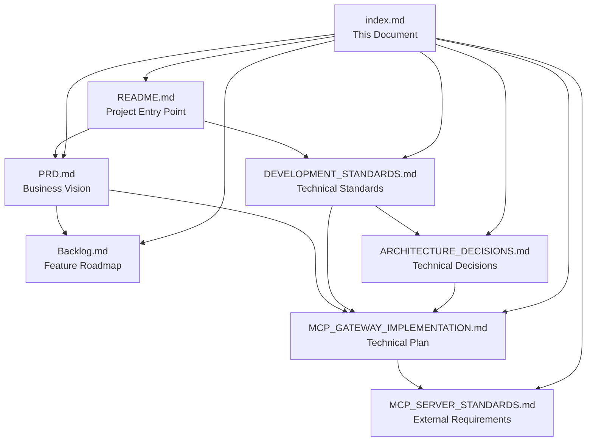

# 🛡️ Arkana MCP Security Gateway - Documentation

> **Enterprise-grade security gateway for Model Context Protocol (MCP) servers**

[](https://dotnet.microsoft.com/)
[](https://azure.microsoft.com/en-us/services/container-apps/)
[](../LICENSE)

---

## 🚀 Quick Start

**New to the project?** Start here:

1. 📋 **[Project Overview](../README.md)** - High-level introduction and quick setup
2. 🎯 **[Product Vision](PRD.md)** - Understanding the business requirements
3. 🏗️ **[Development Standards](DEVELOPMENT_STANDARDS.md)** - Coding guidelines and tech stack
4. 📐 **[Implementation Plan](MCP_GATEWAY_IMPLEMENTATION.md)** - Technical architecture and phases

---

## 📚 Documentation Map

### 🎯 **Business & Strategy**
| Document | Purpose | Audience |
|----------|---------|----------|
| **[PRD.md](PRD.md)** | Product requirements and success criteria | Product Managers, Stakeholders |
| **[Backlog.md](Backlog.md)** | Feature backlog and development roadmap | Product Team, Developers |

### 🏗️ **Architecture & Design**
| Document | Purpose | Audience |
|----------|---------|----------|
| **[ARCHITECTURE_DECISIONS.md](ARCHITECTURE_DECISIONS.md)** | Key technical decisions with rationale | Architects, Senior Developers |
| **[MCP_GATEWAY_IMPLEMENTATION.md](MCP_GATEWAY_IMPLEMENTATION.md)** | Detailed technical implementation plan | Developers, DevOps |

### 👨‍💻 **Development**
| Document | Purpose | Audience |
|----------|---------|----------|
| **[DEVELOPMENT_STANDARDS.md](DEVELOPMENT_STANDARDS.md)** | Coding standards, tech stack, patterns | All Developers |
| **[MCP_SERVER_STANDARDS.md](MCP_SERVER_STANDARDS.md)** | External server integration requirements | External Teams, Partners |

---

## 🎯 Role-Based Quick Paths

### 👑 **Product Manager**
```
PRD.md → Backlog.md → MCP_GATEWAY_IMPLEMENTATION.md (Timeline)
```
Focus on business objectives, feature priorities, and delivery timeline.

### 🏗️ **Solution Architect**
```
PRD.md → ARCHITECTURE_DECISIONS.md → MCP_GATEWAY_IMPLEMENTATION.md → DEVELOPMENT_STANDARDS.md
```
Understand requirements, review technical decisions, and validate implementation approach.

### 👨‍💻 **Developer (New Team Member)**
```
README.md → DEVELOPMENT_STANDARDS.md → MCP_GATEWAY_IMPLEMENTATION.md → ARCHITECTURE_DECISIONS.md
```
Get oriented with the codebase, learn standards, understand implementation details.

### 🔧 **DevOps Engineer**
```
DEVELOPMENT_STANDARDS.md (Deployment) → MCP_GATEWAY_IMPLEMENTATION.md (Phase 6) → ARCHITECTURE_DECISIONS.md (ADR-003)
```
Focus on deployment architecture, container configuration, and infrastructure decisions.

### 🤝 **External MCP Server Developer**
```
MCP_SERVER_STANDARDS.md → README.md (Integration) → PRD.md (Context)
```
Understand integration requirements, test compatibility, get business context.

---

## 📖 Document Relationships



---

## 🔍 Find What You Need

### 🚨 **Common Questions**

**Q: What technology stack are we using?**  
→ [DEVELOPMENT_STANDARDS.md - Technology Stack](DEVELOPMENT_STANDARDS.md#-technology-stack)

**Q: Why did we choose Minimal APIs over FastEndpoints?**  
→ [ARCHITECTURE_DECISIONS.md - ADR-001](ARCHITECTURE_DECISIONS.md#adr-001-migrate-from-fastendpoints-to-minimal-apis)

**Q: How do I build a compatible MCP server?**  
→ [MCP_SERVER_STANDARDS.md](MCP_SERVER_STANDARDS.md)

**Q: What are the security requirements?**  
→ [DEVELOPMENT_STANDARDS.md - Security Standards](DEVELOPMENT_STANDARDS.md#-security-standards)

**Q: When will feature X be delivered?**  
→ [MCP_GATEWAY_IMPLEMENTATION.md - Timeline](MCP_GATEWAY_IMPLEMENTATION.md#-implementation-timeline)

**Q: What connection types do we support?**  
→ [DEVELOPMENT_STANDARDS.md - Connection Types](DEVELOPMENT_STANDARDS.md#-supported-connection-types)

### 🔧 **Implementation Details**

| Topic | Primary Document | Section |
|-------|------------------|---------|
| **Error Handling** | [DEVELOPMENT_STANDARDS.md](DEVELOPMENT_STANDARDS.md) | Error Handling Strategy |
| **Authentication** | [MCP_GATEWAY_IMPLEMENTATION.md](MCP_GATEWAY_IMPLEMENTATION.md) | Phase 2: OIDC Integration |
| **Database Schema** | [MCP_GATEWAY_IMPLEMENTATION.md](MCP_GATEWAY_IMPLEMENTATION.md) | Phase 1: Database Schema |
| **UI Design System** | [DEVELOPMENT_STANDARDS.md](DEVELOPMENT_STANDARDS.md) | UI Design System |
| **Deployment** | [ARCHITECTURE_DECISIONS.md](ARCHITECTURE_DECISIONS.md) | ADR-003: Azure Container Apps |
| **Testing Strategy** | [DEVELOPMENT_STANDARDS.md](DEVELOPMENT_STANDARDS.md) | Testing Strategy |

---

## 🏷️ **Document Status & Versioning**

| Document | Version | Status | Last Updated |
|----------|---------|---------|--------------|
| [PRD.md](PRD.md) | v0.9-draft | ✅ Approved | 2025-08-04 |
| [DEVELOPMENT_STANDARDS.md](DEVELOPMENT_STANDARDS.md) | v1.0 | ✅ Approved | 2025-08-04 |
| [ARCHITECTURE_DECISIONS.md](ARCHITECTURE_DECISIONS.md) | v1.0 | ✅ Approved | 2025-08-04 |
| [MCP_SERVER_STANDARDS.md](MCP_SERVER_STANDARDS.md) | v1.0 | ✅ Approved | 2025-08-04 |
| [MCP_GATEWAY_IMPLEMENTATION.md](MCP_GATEWAY_IMPLEMENTATION.md) | v1.1 | 🔄 Updated | 2025-08-04 |
| [Backlog.md](Backlog.md) | v1.0 | 📝 Living | 2025-08-04 |

---

## 🚦 **Project Status Overview**

### Current Phase: **Phase 2 - Authentication & Authorization** 🔄

| Phase | Status | Key Deliverables | Duration |
|-------|--------|------------------|----------|
| **Phase 1** | ✅ Complete | Database schema, configuration models | ✅ Done |
| **Phase 2** | 🔄 In Progress | OIDC integration, token provisioning | 2 weeks |
| **Phase 3** | 📋 Planned | YARP MCP adapter, routing middleware | 2 weeks |
| **Phase 4** | 📋 Planned | Blazor UI, Minimal API endpoints | 2 weeks |
| **Phase 5** | 📋 Planned | Monitoring, audit system | 1 week |
| **Phase 6** | 📋 Planned | Security hardening, documentation | 1 week |

**🎯 Target MVP Delivery:** 7 weeks from Phase 2 start

---

## 🔗 **External Resources**

### Standards & Specifications
- **[MCP Protocol Specification](https://spec.modelcontextprotocol.io)** - Official MCP protocol docs
- **[JWT Token Validation](https://jwt.io/introduction)** - JWT implementation guide
- **[OpenAPI 3.0 Specification](https://swagger.io/specification/)** - API documentation standard

### Microsoft Documentation
- **[.NET 9 Documentation](https://docs.microsoft.com/en-us/dotnet/)** - Framework reference
- **[YARP Documentation](https://microsoft.github.io/reverse-proxy/)** - Reverse proxy guide
- **[Azure Container Apps](https://docs.microsoft.com/en-us/azure/container-apps/)** - Deployment platform
- **[Blazor WebAssembly](https://docs.microsoft.com/en-us/aspnet/core/blazor/)** - UI framework

### Development Tools
- **[Tailwind CSS](https://tailwindcss.com/docs)** - Utility-first CSS framework
- **[JSON Schema Validator](https://www.jsonschemavalidator.net)** - Schema validation tool

---

## 📞 Support & Contribution

### 🤝 **Getting Help**
- **📖 Documentation Issues**: Create GitHub issue with `documentation` label
- **🐛 Technical Issues**: Create GitHub issue with appropriate component label
- **💡 Feature Requests**: Add to [Backlog.md](Backlog.md) via pull request
- **❓ Questions**: Use GitHub Discussions

### 🔄 **Contributing to Documentation**
1. **Read First**: [DEVELOPMENT_STANDARDS.md](DEVELOPMENT_STANDARDS.md) for style guidelines
2. **Small Changes**: Edit directly via GitHub web interface
3. **Large Changes**: Create feature branch and pull request
4. **New ADRs**: Follow template in [ARCHITECTURE_DECISIONS.md](ARCHITECTURE_DECISIONS.md)

### 📋 **Documentation Standards**
- **Markdown Format**: All docs use GitHub Flavored Markdown
- **Linking**: Use relative links between documents
- **Images**: Store in `_docs/images/` folder (create if needed)
- **Code Examples**: Include language tags for syntax highlighting
- **Updates**: Update "Last Updated" dates when making changes

---

## 🎯 **Success Metrics for Documentation**

- ✅ **Onboarding Time**: New developers productive within 1 day
- ✅ **Decision Context**: All major decisions documented with rationale
- ✅ **External Integration**: Partners can integrate without direct support
- ✅ **Compliance Ready**: Audit-ready documentation for enterprise requirements

---

*📝 This index is maintained by the Core Development Team. Last updated: 2025-08-04*

**🔗 Quick Links:** [Main README](../README.md) | [Development Standards](DEVELOPMENT_STANDARDS.md) | [Implementation Plan](MCP_GATEWAY_IMPLEMENTATION.md) | [Architecture Decisions](ARCHITECTURE_DECISIONS.md)